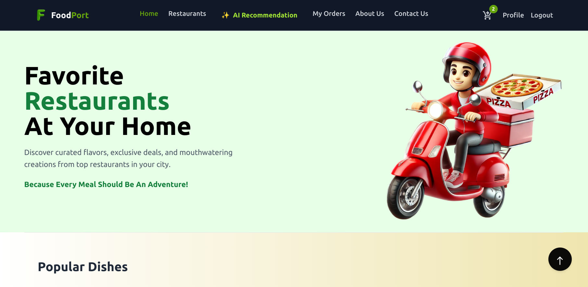

# FoodPort - Next Generation Food Delivery Platform

**FoodPort** is a state-of-the-art online food delivery platform designed using a robust microservices architecture and advanced AI techniques. This project demonstrates deep full‑stack engineering expertise—from scalable backend services and microservices to a dynamic, responsive React frontend. It is built to deliver a seamless user experience while leveraging cutting‑edge AI recommendation systems to personalize food suggestions.

---

## Table of Contents

-   [Overview](#overview)
-   [Key Features](#key--features)
-   [Architecture & Technologies](#architecture--technologies)
-   [AI Recommendation Service](#ai-recommendation-service)
-   [Microservices & Scalability](#microservices--scalability)
-   [Installation & Setup](#installation--setup)
-   [Usage](#usage)
-   [Demo](#demo)
-   [Project Structure](#project-structure)
-   [Future Enhancements](#future-enhancements)
-   [Contributing](#contributing)
-   [License](#license)
-   [Author](#author)

---

## Overview

FoodPort is an innovative online food delivery application that allows users to explore diverse restaurants, browse curated menus, and place orders with ease. A key differentiator is our **AI Recommendation Service** that uses deep learning and similarity search to suggest personalized food items based on user dietary preferences and cuisine interests. This project is a comprehensive demonstration of full‑stack development, advanced AI, and scalable microservices design.

---

## Key Features

-   **AI-Driven Personalized Recommendations**: Tailored food suggestions based on user preferences, dietary restrictions, and order history.
-   **End-to-End Microservices Architecture**: Scalable services handling authentication, ordering, and AI recommendations.
-   **Modern UI/UX**: A sleek, intuitive front-end built with React, Redux, and Tailwind CSS.
-   **Secure & Optimized Backend**: Robust Express.js and MongoDB stack with authentication, rate limiting, and best security practices.
-   **Cloud Deployment**: Hosted on Vercel (frontend), Render/Railway (backend & AI service), and MongoDB Atlas (database).

---

## Demo

Watch our demo video to see FoodPort in action:

[](https://youtu.be/your-demo-video-link)

_Click the image above to watch the demo video._

---

## Architecture & Technologies

### Backend

-   **Node.js & Express.js**: Build a robust RESTful API for handling orders, user management, and more.
-   **MongoDB & Mongoose**: A flexible NoSQL database that supports rapid prototyping and scalable data storage.
-   **Redis & Express-Session**: Efficient session management and caching mechanisms.
-   **FastAPI (Python)**: High-performance API for our AI Recommendation Service.
-   **TensorFlow & FAISS**: Advanced machine learning and similarity search frameworks for real‑time personalized recommendations.
-   **Microservices Architecture**: Deployed as independent, containerized microservices ensuring high scalability and maintainability.

### Frontend

-   **React & Redux Toolkit**: Modern, component-based UI with centralized state management.
-   **React Router**: Seamless navigation between various application views.
-   **Tailwind CSS & MUI**: Utility‑first styling for a modern, responsive design.
-   **Axios & React Hot Toast**: Efficient HTTP requests and user-friendly notifications.

---

## AI Recommendation Service

The **AI Recommendation Service** is the heart of FoodPort’s personalization. It uses advanced deep learning models (TensorFlow) and FAISS for high‑performance similarity search, enabling the following:

-   **Dynamic Embedding Generation**: Utilize a trained deep learning model to generate product embeddings.
-   **Efficient Similarity Search**: Leverage FAISS to quickly retrieve relevant products from a vast dataset.
-   **Personalized Filtering**: Filters recommendations based on user-specific dietary preferences and preferred cuisine.
-   **Scalable Microservice**: Built with FastAPI, designed for low latency and high concurrency, making it perfect for deployment in cloud environments and Kubernetes clusters.

---

## Microservices & Scalability

-   **Independent Deployment**: Each service (backend APIs, AI recommendation service) can be developed, deployed, and scaled independently.
-   **Containerization**: Leverage Docker (and Kubernetes) to ensure consistent deployment across environments.
-   **CI/CD Pipeline**: Automated testing, linting, and continuous deployment ensure rapid and reliable releases.
-   **Monitoring & Logging**: Robust error handling, logging (PM2, centralized logging), and performance monitoring are integrated to maintain system resilience.

---

## Installation & Setup

### Prerequisites

-   Node.js (v14+)
-   Python (3.8+)
-   MongoDB
-   Redis
-   Docker (optional, for containerized deployment)

### Backend Setup

1. **Clone the repository:**

    ```bash
    git clone https://github.com/imunreal7/FoodPort.git
    cd FoodPort/backend
    ```

2. **Install dependencies:**

    ```bash
    npm install
    ```

3. **Configure Environment Variables:**

    Create a `.env` file with variables such as:

    ```
    JWT_SECRET_KEY=your_jwt_secret
    MONGODB_URI=your_mongodb_connection_string
    FRONTEND_URL=your_frontend_url
    DB_URI=your_database_uri
    ```

4. **Start the Backend Server:**

    ```bash
    npm start
    ```

### AI Recommendation Service Setup

1. **Navigate to the recommendation service folder:**

    ```bash
    cd ../recommendation_service
    ```

2. **Install Python dependencies:**

    ```bash
    pip install -r requirements.txt
    ```

3. **Ensure model and index files are in place, then run:**

    ```bash
    uvicorn main:app --host 0.0.0.0 --port 8000
    ```

### Frontend Setup

1. **Navigate to the client directory:**

    ```bash
    cd ../client
    ```

2. **Install dependencies:**

    ```bash
    npm install
    ```

3. **Start the Frontend Application:**

    ```bash
    npm start
    ```

---

## Usage

-   **Restaurant & Menu Exploration:** Browse highly rated restaurants and detailed menus.
-   **Personalized Recommendations:** Leverage the AI-powered recommendation engine for curated food suggestions.
-   **Easy Order Placement:** Add items to your cart, proceed to checkout, and track orders seamlessly.
-   **User Profile Management:** Update personal information, dietary preferences, and more.

---

## Future Enhancements

-   **Advanced Analytics:** Incorporate user behavior tracking and advanced analytics to further refine AI recommendations.
-   **Enhanced Security:** Integrate multi-factor authentication and secure payment gateways.
-   **Global Support:** Implement internationalization (i18n) and multi-language support.
-   **Progressive Web App (PWA):** Enable offline support and improved mobile performance with PWA features.

---

## Contributing

Contributions, improvements, and bug fixes are welcome! Please fork the repository and open a pull request with your proposed changes.

---

## License

This project is licensed under the ISC License.

---

## Author

**Aman Dubey**
Senior Software Engineer | Full-Stack Developer | AI Enthusiast
[GitHub](https://github.com/imunreal7) | [LinkedIn](https://www.linkedin.com/in/amandubey7/)

---

_Thank you for checking out FoodPort – a showcase of cutting-edge microservices, AI, and full-stack development expertise._

