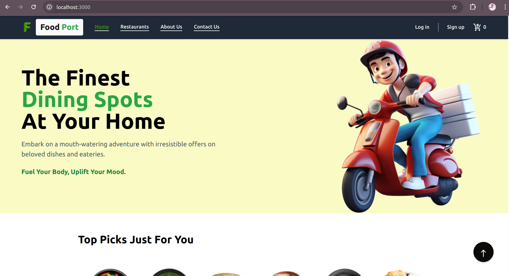

# FoodPort

FoodPort is an online food delivery web application that allows users to explore a variety of restaurants, browse menus, and place orders conveniently. The project is built with the MERN stack (MongoDB, Express, React, and Node.js) and styled with Tailwind CSS.

## Project Structure

The project is divided into two main directories:

-   **Backend**: Contains the server-side code, API routes, and database models.
-   **Frontend (Client)**: Contains the React frontend application that interacts with the backend.

## Technologies Used

### Backend

-   **Node.js**: Server runtime
-   **Express.js**: Backend framework for building RESTful APIs
-   **MongoDB**: NoSQL database for storing data
-   **Mongoose**: ODM for MongoDB
-   **dotenv**: Environment variable management
-   **cors**: Middleware for handling Cross-Origin Resource Sharing

### Frontend

-   **React**: JavaScript library for building user interfaces
-   **React Router**: For routing between different pages
-   **Redux Toolkit**: State management for handling global application state
-   **MUI (Material-UI)**: UI component library
-   **Axios**: For making HTTP requests
-   **Tailwind CSS**: Utility-first CSS framework for styling

## Installation

1. **Clone the repository:**

    ```bash
    git clone https://github.com/imunreal7/FoodPort.git
    cd FoodPort
    ```

2. **Install backend dependencies:**

    ```bash
    cd backend
    npm install
    ```

3. **Set up environment variables:**

    - Create a `.env` file in the `backend` folder with the following variables:
        ```
        JWT_SECRET_KEY=your_jwt_secret
        MONGODB_URI=your_mongodb_connection_string
        ```

4. **Install frontend dependencies:**
    ```bash
    cd ../client
    npm install
    ```

## Usage

### Running the Backend

1. Start the backend server:
    ```bash
    cd backend
    npm start
    ```
2. The server will run on `http://localhost:5000`.

### Running the Frontend

1. Start the frontend application:
    ```bash
    cd client
    npm start
    ```
2. The application will run on `http://localhost:3000`.

## Accessing Data and Postman Collection

### 1. **Accessing and Using the MongoDB Data Locally**

To set up the database on your local machine, follow these steps:

#### Prerequisites:

-   **MongoDB** should be installed locally. You can download and install MongoDB from [here](https://www.mongodb.com/try/download/community).
-   **Node.js** and **npm** should be installed. You can download them from [here](https://nodejs.org/).

#### Steps:

1. **Clone the repository**:
   Clone the repository to your local machine using the following command:
    ```bash
    git clone <repository-url>
    ```
2. **Navigate to the `DB` folder**:
   Inside the project directory, go to the `backend/DB` folder. You will find two `.json` files:

    - `restaurant.json`
    - `product.json`

3. **Import JSON files into MongoDB**:
   To import these `.json` files into your local MongoDB database, use the following commands:

    - First, start your MongoDB server if it's not already running:
        ```bash
        mongod
        ```
    - Next, open a terminal and use the `mongoimport` command to import the data:
        ```bash
        mongoimport --db <your-db-name> --collection restaurant --file <path-to-your-repository>/FoodPort/backend/DB/My\ DB/restaurant.json --jsonArray
        mongoimport --db <your-db-name> --collection product --file <path-to-your-repository>/FoodPort/backend/DB/My\ DB/product.json --jsonArray
        ```
    - Replace `<your-db-name>` with the name of your database (e.g., `foodport`).

4. **Verify data import**:

    - Open the MongoDB shell by typing `mongo` in the terminal.
    - Switch to the database:
        ```bash
        use <your-db-name>
        ```
    - Verify the collections:
        ```bash
        db.restaurant.find().pretty()
        db.product.find().pretty()
        ```

5. **Start the backend server**:
    - Install required dependencies by running:
        ```bash
        npm install
        ```
    - Start your backend server:
        ```bash
        npm start
        ```
    - Your MongoDB data should now be accessible via the backend routes.

---

### 2. **Using Postman Collection**

The Postman collection is included in the project to test the API routes easily. Here's how to use it:

1. **Install Postman**:
   If you don't have Postman installed, download and install it from [here](https://www.postman.com/downloads/).

2. **Import the Postman Collection**:

    - Open Postman.
    - Click on the **Import** button in the top left corner.
    - Choose the **File** tab and select the `FoodPort.postman_collection.json` file from the `backend/Postman Collection` folder.
    - The collection will be added to your Postman.

3. **Test the API**:
    - Once the collection is imported, you can start testing the API endpoints defined in the collection.
    - Make sure your backend server is running (`npm start`), and then execute the requests from Postman.
    - The collection contains predefined requests for different routes of the API, such as getting all restaurants, adding products, etc.

---

## Features

-   **Restaurant and Product Listings**: Explore various restaurants and their menu items.
-   **Responsive Design**: Optimized for both mobile and desktop views.
-   **State Management with Redux**: Manage application state efficiently.
-   **Styled with Tailwind CSS**: Clean and modern UI.

## Future Enhancements

-   **User Authentication**: Implement user signup and login functionality.
-   **Order Management**: Allow users to place and track orders.
-   **Payment Integration**: Integrate secure payment options for easy transactions.
-   **Reviews and Ratings**: Enable users to rate and review restaurants.

## Project Screenshot

### Home Page

Here is a screenshot of the **Home Page** of the FoodPort application:



## License

This project is licensed under the ISC License.

## Author

Developed by Aman Dubey.

